# 🛒 Olist E-Commerce Analytics — SQL + PostgreSQL

> Análise exploratória de dados reais de uma das maiores plataformas de e-commerce do Brasil, com foco em performance de vendas, logística, comportamento de clientes e saúde do negócio.

---

## 🎯 Objetivo

Responder perguntas de negócio relevantes usando SQL puro sobre o dataset público da Olist:
- Qual é a saúde geral do negócio?
- Quais categorias e vendedores geram mais receita?
- Como é a performance logística por estado?
- Quando os clientes compram mais?
- Qual o perfil de recorrência dos clientes?

---

## 🛠️ Tecnologias

| Ferramenta | Uso |
|---|---|
| PostgreSQL | Banco de dados relacional |
| SQL | Análise exploratória e KPIs |
| VS Code + SQLTools | Execução das queries |

---

## 📐 Modelo de Dados

```
customers (customer_id, customer_unique_id, customer_zip_code_prefix, customer_city, customer_state)
    │
    └── orders (order_id, customer_id, order_status, order_purchase_timestamp,
                order_approved_at, order_delivered_carrier_date,
                order_delivered_customer_date, order_estimated_delivery_date)
                    │
                    ├── items (order_id, order_item_id, product_id, seller_id,
                    │          shipping_limit_date, price, freight_value)
                    │               │
                    │           products (product_id, product_category_name, ...)
                    │           sellers  (seller_id, ...)
                    │
                    └── payments (order_id, payment_type, payment_value, ...)
```

---

## 📊 Resultados e Insights

### 🔢 KPIs Gerais

| Métrica | Valor |
|---|---|
| Total de pedidos entregues | 96.477 |
| Receita total | R$ 15.422.461,77 |
| Ticket médio | R$ 153,07 |
| Taxa de entrega no prazo | **93,2%** |

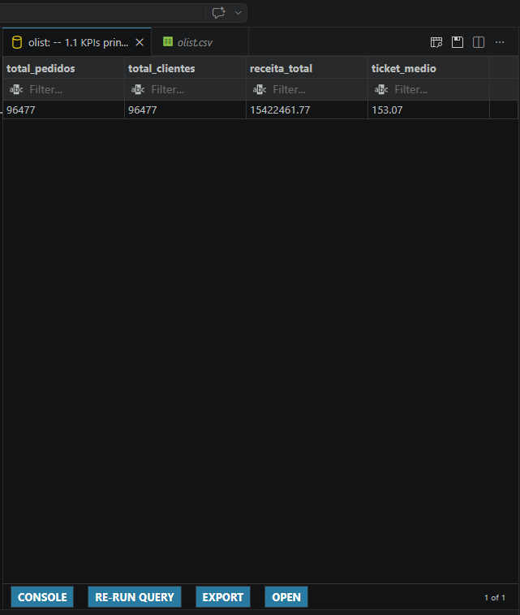

---

### 📦 Status dos Pedidos

97% dos pedidos foram entregues com sucesso. A taxa de cancelamento é de apenas 0,6%, indicando boa saúde operacional.

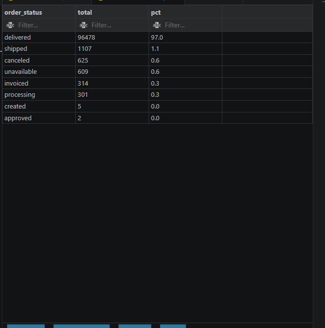

---

### 📅 Taxa de Cancelamento por Mês

Os meses iniciais (2016) apresentam alta variação por baixo volume. A partir de 2017 a taxa se estabiliza abaixo de 1,5%, com pico em ago/2018.

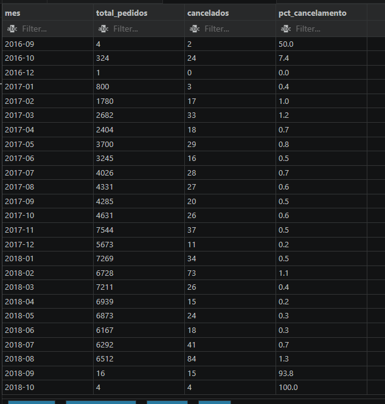

---

### 🗺️ Entrega por Estado

Estados do Norte e Nordeste têm os maiores tempos de entrega. Roraima (RR) lidera com média de **29,3 dias**, enquanto Paraná (PR) tem a entrega mais rápida com **11,9 dias** — uma diferença de 2,5x entre as regiões.

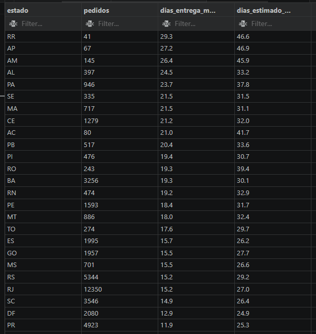

---

### ✅ Pedidos no Prazo vs Atrasados

93,2% dos pedidos foram entregues no prazo ou antes. Apenas 6,8% tiveram atraso.

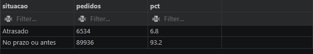

> 💡 **Insight:** Em todos os estados, o prazo estimado é bem maior que o real — a Olist é conservadora nas estimativas, o que contribui para a alta taxa de entregas "no prazo".

---

### 🏆 Top Categorias por Receita

`beleza_saude` lidera em receita com R$ 1,2M em 8.647 pedidos. Destaque para `relogios_presentes` que, com menos pedidos (5.495), tem o maior ticket médio entre as top 10 (R$ 199,04).

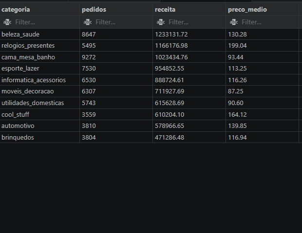

---

### 🚚 Logística: Frete vs Preço

Categorias com frete alto relativo ao preço indicam desafios logísticos. `artigos_de_natal` tem o frete mais caro proporcionalmente (36,7% do preço), seguido de `sinalizacao_e_seguranca` (30,3%) — produtos volumosos ou frágeis que encarecem o envio.

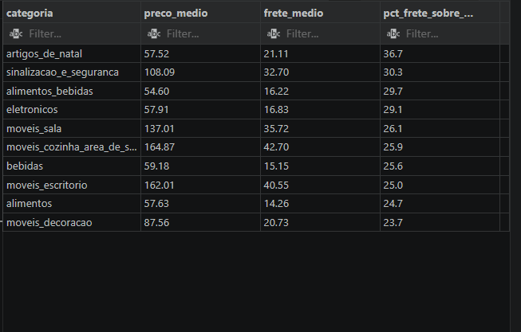

---

### 💰 Top Sellers

O seller com maior receita gerou R$ 226.987,93 em 1.124 pedidos. Interessante notar que o segundo colocado em receita (R$ 217.940,44) fez apenas 348 pedidos — ticket médio de R$ 544,85, quase 3x a média geral.

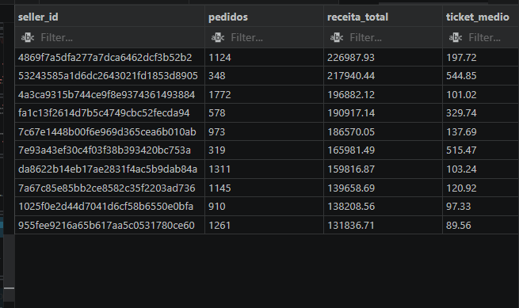

---

### ⚠️ Sellers com Alta Taxa de Cancelamento

Um seller chegou a 20% de cancelamento (4 de 20 pedidos), sinalizando possível problema de estoque ou qualidade. Dado útil para times de controle de qualidade de marketplace.

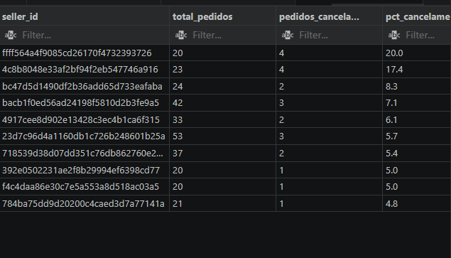

---

### 👥 Clientes por Estado

São Paulo concentra 42% de todos os pedidos (40.500) e R$ 5,7M em receita. Os 3 primeiros estados (SP, RJ, MG) respondem por mais de 60% da receita total.

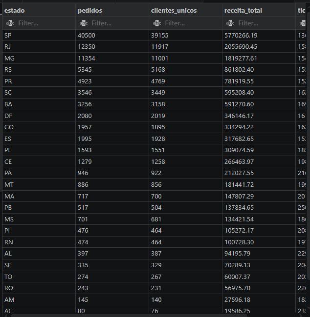

---

### 🔁 Recorrência de Clientes

97% dos clientes fizeram apenas 1 pedido — dado típico de marketplaces brasileiros e que indica grande oportunidade de retenção.

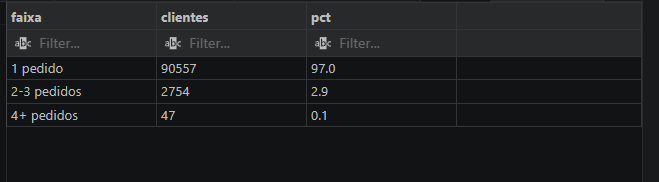

---

### 📈 Receita Mensal

Crescimento consistente ao longo de 2017, com pico em novembro (Black Friday). Em 2018 a receita se estabiliza em torno de R$ 1M/mês.

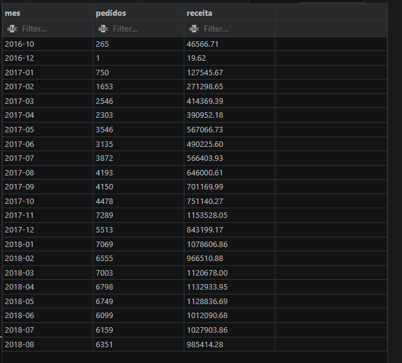

---

### 📅 Pedidos por Dia da Semana

Segunda e terça-feira são os dias de maior volume. O final de semana cai significativamente — domingo tem 26% menos pedidos que segunda.

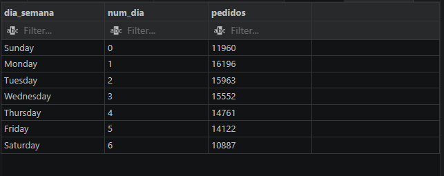

---

### ⏰ Horário de Pico

O pico ocorre entre **10h e 16h**, com destaque para as 11h e 16h. A madrugada (3h–5h) tem volume mínimo.

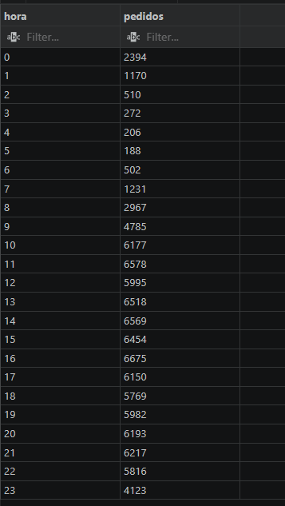

---

## 🔍 Conceitos SQL Demonstrados

- `JOIN` entre 4+ tabelas simultaneamente
- `GROUP BY` com múltiplas agregações
- `Subqueries` no `FROM` para cálculos em duas etapas
- `CASE WHEN` para categorização e pivot
- `HAVING` para filtrar após agregação
- `NULLIF` para evitar divisão por zero
- `OVER()` para window function de percentual
- Cast de tipos (`::NUMERIC`, `::DATE`) no PostgreSQL
- Funções de data (`TO_CHAR`, `EXTRACT`)

---

## 🚀 Como Reproduzir

1. Baixar o dataset: [Brazilian E-Commerce (Olist) no Kaggle](https://www.kaggle.com/datasets/olistbr/brazilian-ecommerce)
2. Criar banco PostgreSQL e importar os CSVs
3. Rodar as queries em `queries/analysis.sql`

---

## 👩‍💻 Sobre

Projeto desenvolvido como parte do portfólio de transição para **Análise de Dados**.
Veja também: [Patient Wellbeing Tracker](https://github.com/nataliaschwaab/patient-wellbeing-tracker) | [Dashboard Vendas Globais](https://github.com/nataliaschwaab/dashboard-vendas-globais)
